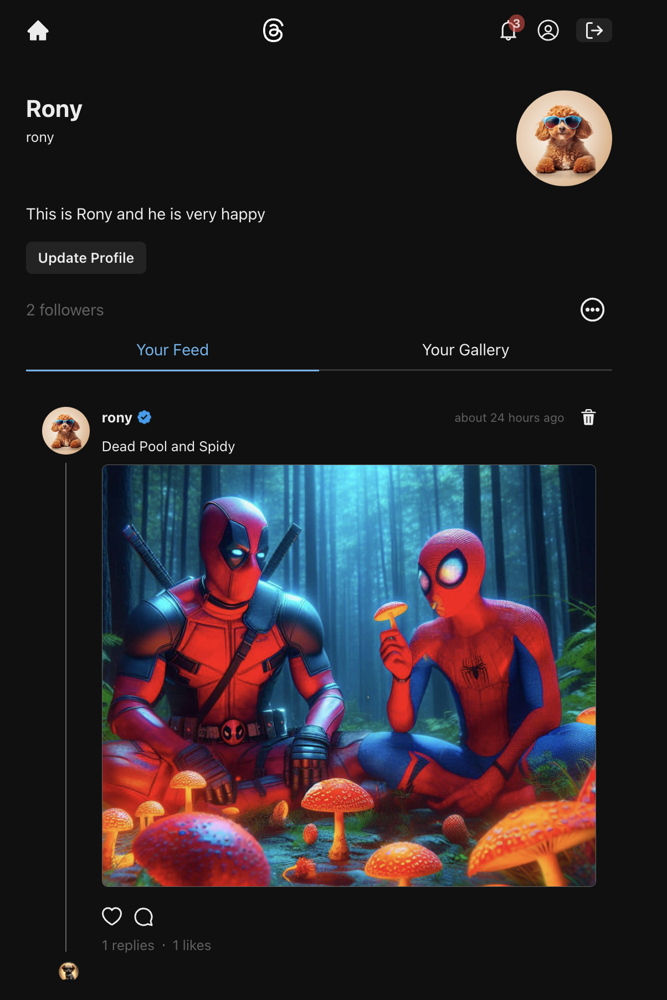
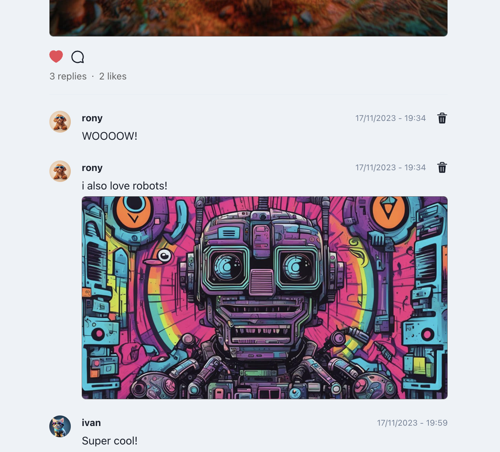
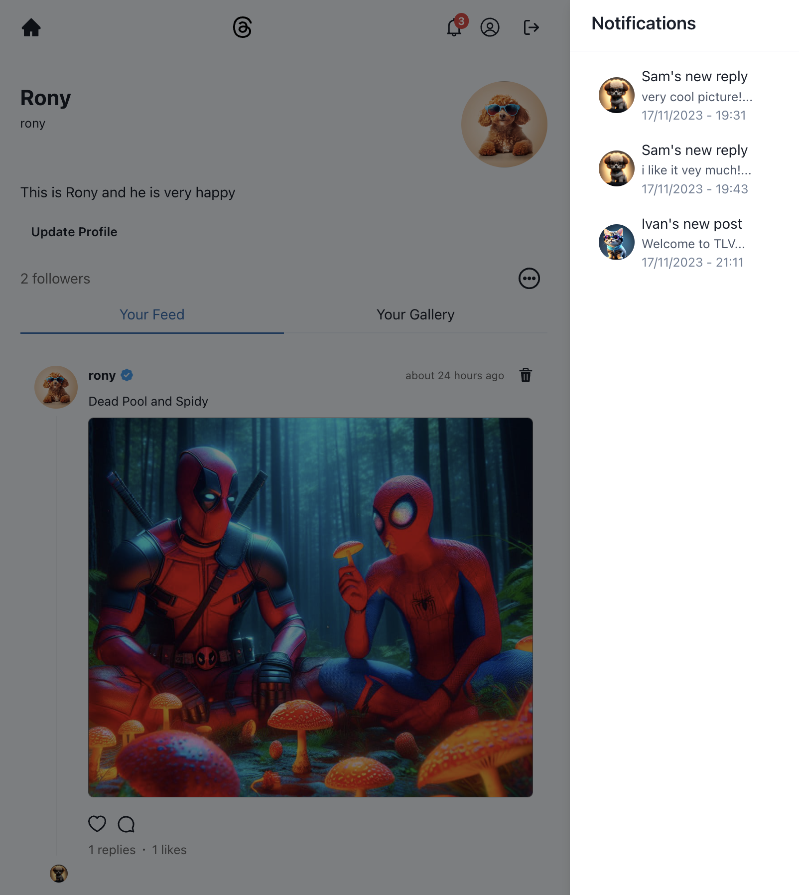
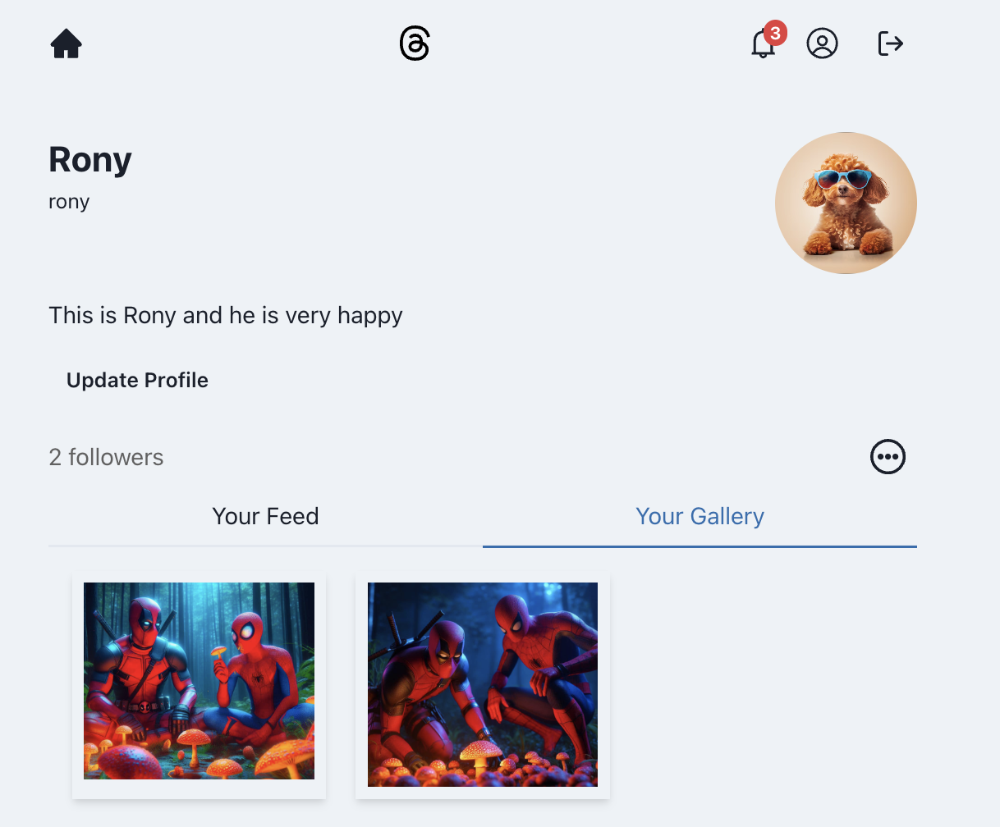

# Threads Clone

## Introduction
Welcome to Threads Clone, a web-based social media network inspired by Threads. This project offers a rich set of features allowing users to engage in a vibrant social environment. Here's what you can do:










- **Create and Update User Profiles:** Sign up and personalize your profile. Keep it fresh by updating your information anytime.
- **Follow/Unfollow Users:** Connect with others by following their profiles and, if needed, you can unfollow them too.
- **Post and Interact:** Share your thoughts and moments by creating posts, complete with image uploads. Engage with others by replying to their posts with images.
- **Dark/Light Mode:** Choose your preferred theme for the best viewing experience.
- **Mobile Responsive Design:** Enjoy a seamless experience on both desktop and mobile devices.
- **Notification System:** Stay updated with the activities of the users you follow.

## Technologies Used
This project is built using a combination of robust technologies:

- **Backend:**
  - [NodeJS](https://nodejs.org/)
  - [ExpressJS](https://expressjs.com/)
  - [MongoDB](https://www.mongodb.com/)
  - [JWT](https://jwt.io/)
  - [Cloudinary](https://cloudinary.com/)

- **Frontend:**
  - [ReactJS](https://reactjs.org/)
  - [ChakraUI](https://chakra-ui.com/)

## Installation
To get started with this project, follow these steps:

1. Clone the repository:
   ```bash
   git clone https://github.com/ilyanosovsky/threads-clone.git
    ```
2. Navigate to the project directory:
    ```bash
    cd threads-clone
    ``` 
3. Install dependencies for both frontend and backend:
    ```bash
    # Backend
    cd backend
    npm install

    # Frontend
    cd frontend
    npm install
    ``` 
## Setting Up the .env File
You'll need to set up your .env file with the necessary configurations. Here's a template to get you started:
    ```env
    # Backend .env configuration
    DB_URI=<your_mongodb_uri>
    JWT_SECRET=<your_jwt_secret>
    CLOUDINARY_NAME=<your_cloudinary_name>
    CLOUDINARY_API_KEY=<your_cloudinary_api_key>
    CLOUDINARY_API_SECRET=<your_cloudinary_api_secret>

    # Frontend .env configuration (if needed)
    REACT_APP_API_URL=<your_backend_api_url>
    ``` 
Replace the placeholders with your actual configuration values.

